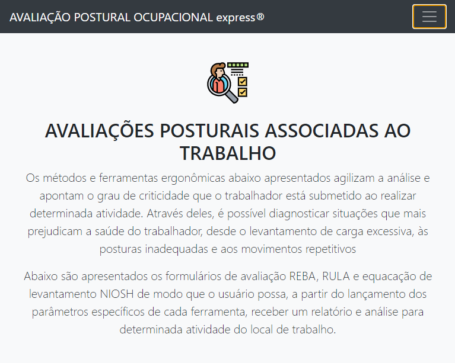

# Avaliação postural ocupacional :memo:

 Trabalho de conclusão de curso especialização em Segurança do Trabalho, apresentado a Coordenação de Pós-Graduação e Educação Continuada do Centro Universitário de João Pessoa.
 
 
 
 ## :clipboard: Sobre o Projeto
O projeto tem por objetivo o desenvolvimento e disponibilização de uma aplicação para internet cuja finalidade é a elaboração rápida e facilitada de relatórios de avaliação postural ocupacional para profissional de segurança e saúde do trabalho.

A iniciativa partiu da necessidade de avaliação de riscos ergonômicos para os postos de trabalhos de inúmeras empresas, decorrente das atualizações das normas regulamentadores do trabalho, em especial as que avaliam os riscos ocupacionais.

O trabalho foi desenvolvido em âmbito de trabalho de conclusão de curso da Especialização em Engenharia de Segurança do Trabalho do Centro Universitário de João Pesssoa, concomitantemente com as atividade da disciplina de Programação Web do Curso de Graduação em Ciências da Computação da mesma instituição.

## :pushpin: Métodos de análise

Disponibilizam-se o seguintes métodos de análise:
- RULA: Rapid Upper Limb Assessment
- REBA: Rapid Entire Body Assessment
- NIOSH EQUATION: Equação de levantamento manual de carga
